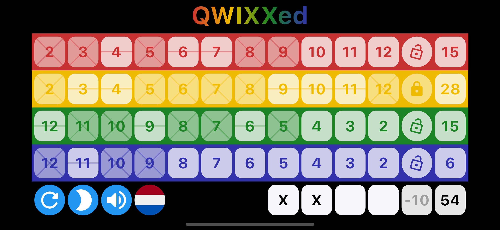
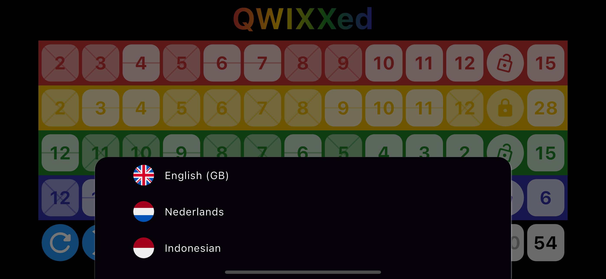
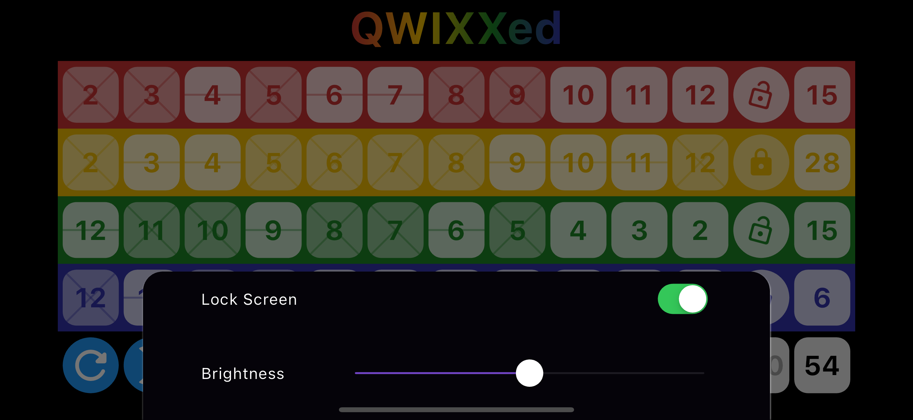
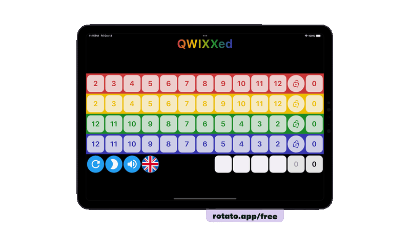

# QWIXXed

iOS, Android & Web App that helps you with playing the popular game of QWIXX. It keeps track of your score and offers some useful additional features.

  

  

  

  

Videos were made using Rotato (https://rotato.app/)

# Features

- Keep track of your QWIXX score with ease. The app only lets you make valid moves and automatically calculates your score
- Prevent the screen from turning off
- Turn on / off sound
- Adjust the screen brightness
- Choose from 3 languages (English, Dutch and Indonesian)
- The app saves your settings

# Tech Stack

The iOS / Android App was built using Google Flutter.

# Source Code Repositories (private)

| Description                       | Repo                                  |
| --------------------------------- | ------------------------------------- |
| Front iOS / Android App - Flutter | https://github.com/jbijlsma/dnw-qwixx |
